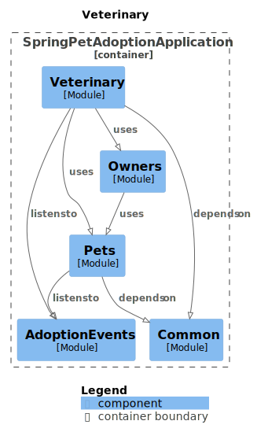

# Demo outline

## What will we see during the demo?
The purpose of the demo is to show the power of **sociable testing**.
I will demonstrate the differences between both solitary and sociable unit testing,
where we will investigate some different aspects:
- Test setup
- Test complexity
- Test focus
- Test readability
- Test maintainability

Check the **[comparison](comparison.md) page** for more details.

## Demo application overview

## Scenario
- Start from the demo-base branch (or check out a new branch from here for the demo)
- We focus on the 'veterinary' module
- Our main focus are the unit tests of the [VeterinaryService](src/main/java/io/github/wouterbauweraerts/samples/sociablepetadoption/veterinary/VeterinaryService.java)
- For this class I created multiple (similar) tests classes
    - [Solitary test](src/test/java/io/github/wouterbauweraerts/samples/sociablepetadoption/veterinary/GetCheckupPriceTest.java) 
    - [Sociable test](src/test/java/io/github/wouterbauweraerts/samples/sociablepetadoption/veterinary/GetCheckupPriceSociableTest.java) 
    - [Sociable test using **UnitSocializer**](src/test/java/io/github/wouterbauweraerts/samples/sociablepetadoption/veterinary/GetCheckupPriceUnitSocializerTest.java) 
- All these tests work out of the box
- Let's see how the tests work
   - solitary tests use MockitoExtension with @Spy, @Mock and @InjectMocks
   - sociable tests without UnitSocializer: use @BeforeEach, but we still use @MockitoExtension with @Mock for our mocks
   - sociable tests with UnitSocializer: see [UnitSocializer quick start](UnitSocializer101.md)
- Refactoring the code: replace the implementation in the [VeterinaryService](src/main/java/io/github/wouterbauweraerts/samples/sociablepetadoption/veterinary/VeterinaryService.java)
  (getCheckupPrice, line 81–110) with the extracted implementation in [CheckupPriceCalculator](src/main/java/io/github/wouterbauweraerts/samples/sociablepetadoption/veterinary/internal/CheckupPriceCalculator.java)
- Rerun the tests! → Compilation fails
- Fix compile errors and rerun the 3 test classes
  - Sociable tests (both with and without UnitSocializer) now pass
  - Solitary tests still fail (as expected), because mocks are not set up correctly

## Conclusion
- Solitary tests are easy to write, but become a pain in the *ss when refactoring your code
- Sociable tests may require some more effort during setup, but they are much more stable and can withstand refactoring
- UnitSocializer can help reduce the setup, but I still need to add some features to make it more powerful